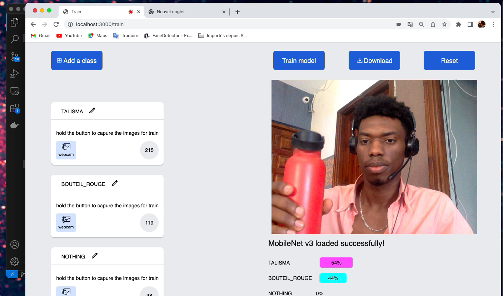

# Teachable Machine

a Web App for fast train a neural network based on tensorflowjs, have fun ;)

The app builds a custom model in the browser using MobileNet as a feature extractor, training a Dense classifier with tf.sequential(), and then combining the two into a single model for download . The model is exported as a JSON file and the weights as binary files, which can later be loaded to make predictions. The model is trained with TensorFlow.js, a JavaScript machine learning library, and can be used directly in the browser or on a Node.js server. The code also includes a simple user interface to train the model and make predictions with it.

